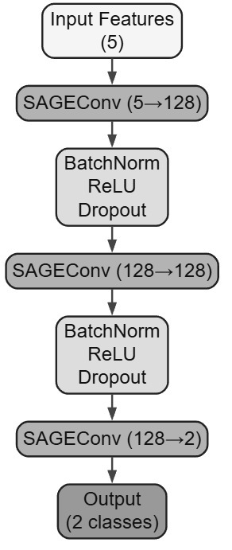

# Rumor Detection with Graph Neural Networks

This project implements a Graph Neural Network (GNN) approach to detect recurring rumor spreaders in social media using the PHEME dataset. The model leverages both user behavioral features and social network structure to identify users who consistently spread misinformation across multiple events.

## Dataset

This project uses the **PHEME dataset** which contains annotated Twitter threads from nine major news events. The dataset includes:
- Source tweets and their reactions
- Veracity annotations (rumor vs non-rumor)
- User metadata and engagement metrics
- Temporal information for propagation analysis

**Dataset Source**: [PHEME Dataset on Kaggle](https://www.kaggle.com/datasets/usharengaraju/pheme-dataset)

**Setup**: Download and extract the dataset to the `pheme_dataset/` folder in the project directory.

## Problem Definition

We define a **recurring rumor spreader** as a user who:
1. Participates in multiple news events
2. Has a rumor ratio > 0.6 (60% of their tweets are labeled as rumors)

The goal is to identify these persistent misinformation spreaders rather than individual false claims, enabling more efficient and proactive mitigation strategies.

## Environment Setup

### Option 1: Using conda (Recommended)

```bash
# Create conda environment
conda env create -f environment.yml

# Activate the environment
conda activate rumor_detection
```

### Option 2: Using pip

```bash
# Install dependencies
pip install -r requirements.txt
```

## Project Structure

```
├── model.py                          # Main GNN model implementation
├── pheme_dataset.py                  # Data preprocessing and feature extraction
├── convert_veracity_annotations.py   # Utility script for data conversion
├── requirements.txt                  # Python dependencies
├── environment.yml                   # Conda environment file
├── README.md                         # This file
├── gnn_architecture                  # Model architecture description
├── graphviz.png                      # Model visualization
└── pheme_user_features_multi_event.csv  # Sample processed data
```

## Usage

### 1. Data Preprocessing

If you have the full PHEME dataset, run the preprocessing script:

```bash
python pheme_dataset.py
```

This will:
- Extract user-level features from Twitter threads
- Compute behavioral and network metrics
- Generate sentiment scores using BERT
- Create the processed dataset for model training

### 2. Model Training and Evaluation

Run the main model script:

```bash
python model.py
```

This will:
- Load the processed data
- Train the GNN model with 5-fold cross-validation
- Compare against baseline models (Logistic Regression, SVM)
- Output performance metrics and results

## Model Architecture

The proposed model uses a **GraphSAGE** architecture:



## Results

The GNN model achieves superior performance compared to traditional machine learning approaches:

| Model | Macro-F1 | Precision | Recall | ROC-AUC |
|-------|----------|-----------|--------|---------|
| Dummy Classifier | 0.506 | 0.506 | 0.506 | N/A |
| Logistic Regression | 0.508 | 0.540 | 0.555 | 0.572 |
| SVM | 0.492 | 0.538 | 0.552 | 0.581 |
| **GNN (Proposed)** | **0.626** | **0.627** | **0.628** | **0.667** |

**Key Improvements:**
- 23.2% improvement in Macro-F1 score over Logistic Regression
- Better balanced precision-recall performance
- Superior ROC-AUC and PR-AUC scores

